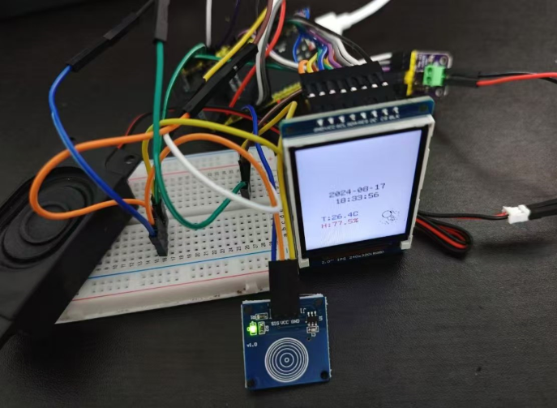
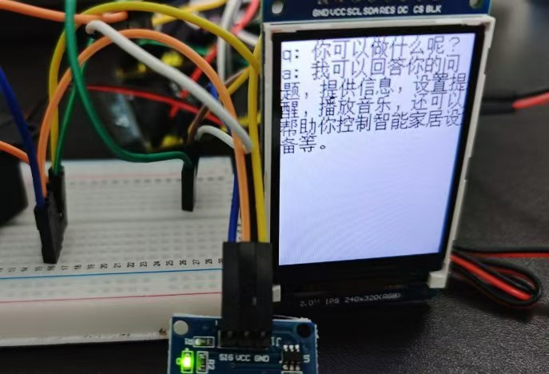
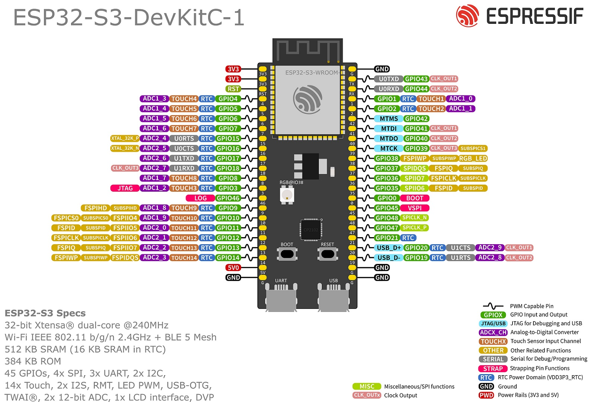

# ESP32-AI-chat

## 简介

本项目使用ESP32-S3基于 [MicroPython](https://docs.micropython.org/en/latest/esp32/general.html) 开发，集成讯飞星火大模型，实现智能语音对话和可视化显示。项目灵感源自 [Explorerlowi ESP32_AI_LLM](https://github.com/Explorerlowi/ESP32_AI_LLM)。


## 功能介绍

### 核心功能
* **智能语音对话**: 集成讯飞星火大模型，支持自然语言问答
* **语音识别**: 实时语音转文字，支持噪音检测
* **语音合成**: 文字转语音播放，支持多种音色
* **可视化界面**: 时间显示、聊天界面

### 硬件功能
* **环境监测**: DHT20温湿度传感器数据采集
* **网络同步**: 自动WiFi连接和NTP时间同步  
* **交互控制**: 触摸按钮触发语音对话


## 使用说明

### 开通讯飞相关服务

1. 进入讯飞开发平台主页 https://www.xfyun.cn 注册账号，然后进入控制台，创建新应用。
2. 开通相关服务：
   * 星火认知大模型 ->  Spark Pro / Spark Max / Spark4.0 Ultra http
   * 语音识别 -> 语音听写（流式版） websocket
   * 语音合成 -> 在线语音合成（流式版） websocket
3. 记录 APPID APISecret APIKey

### 项目部署

#### 开发环境要求
* 开发环境: [thonny](https://thonny.org) + [MicroPython](http://micropython.86x.net/en/latet/esp32/tutorial/intro.html) v1.25.0 + esp32-s3N16R8 
* 硬件连接: 设备UART(COM)口连接电脑进进行固件刷入，USB口用于开发调试上传代码
* 固件刷入: [esp32-s3固件](https://micropython.org/download/ESP32_GENERIC_S3/)
    * 推荐: [ESP32_GENERIC_S3_OCT v1.25.0](https://micropython.org/resources/firmware/ESP32_GENERIC_S3-SPIRAM_OCT-20250415-v1.25.0.bin)

#### 部署步骤

1. **上传项目文件**
   * 将整个 `src/` 目录的所有文件和文件夹上传到 ESP32 设备的根目录 `/`
   * 保持目录结构完整，包括 `hardware/`、`services/`、`ui/` 等子目录

2. **配置文件修改**
   * 编辑 `config.py` 文件，填写以下必要配置：
     - `WIFI_SSID` 和 `WIFI_PASS`: WiFi网络配置
     - `XF_APPID`、`XF_APISecret`、`XF_APIKey`: 讯飞API密钥
     - 根据实际硬件连接调整引脚配置（如有必要）

3. **模块功能测试**
   * 显示功能测试: 运行 `hardware/_display.py`
   * 声音录制播放测试： 运行 `hardware/audio.py`
   * 按钮功能测试：运行 `hardware/_button.py`
   * 网络连接测试: 运行 `services/network.py`  
   * AI对话测试: 运行 `services/ai_chat.py`
   * 语音合成测试: 运行 `services/text_to_speech.py`
   * 语音识别测试: 运行 `services/speech_recognition.py`
   * UI界面测试: 运行 `ui/views.py`

4. **完整功能测试**
   * 运行 `main_ai.py` 测试完整的语音对话功能
   * 通过按钮触发测试语音识别→AI问答→语音播放的完整流程

5. **开启自启动**
   * 功能测试正常后，将 `main_ai.py` 重命名为 `main.py` 实现开机自启

#### 故障排除

* **网络连接问题**: 检查WiFi配置，确认网络畅通
* **API调用失败**: 验证讯飞API密钥配置正确，账户余额充足
* **硬件错误**: 检查引脚连接，确认硬件供电正常
* **内存不足**: 设备重启，运行 `import gc; gc.collect()` 清理内存

### 硬件清单

* ESP32-S3-N16R8、INMP441麦克风、MAX98357音频放大器、DHT20温湿度传感器、喇叭、TFT屏幕、面包板 、触摸开关、杜邦线若干、TypeC数据线

### 硬件接线

* INMP441 麦克风：

| 序号 | 模块引脚 | 引脚说明           | 开发板 |
| ---- | -------- | ------------------ | ------ |
| 1    | GND      | 电源地             | GND    |
| 2    | VDD      | 3.3v电源           | 3.3v   |
| 3    | SD       | 串行数据输出       | GPIO39 |
| 4    | WS       | 串行数据字选择     | GPIO41 |
| 5    | SCK      | I2S串行数据时钟    | GPIO40 |
| 6    | L/R      | 电源地(声音更清楚) | GND    |

* MAX98357 音频放大模块 ：
    * 喇叭(3瓦 8欧)  正（红）负（黑）极接入

| 序号 | 模块引脚 | 引脚说明               | 开发板 |
| ---- | -------- | ---------------------- | ------ |
| 1    | GND      | 电源地                 | GND    |
| 2    | VIN      | VCC 电源               | 3.3v   |
| 3    | DIN      | 数字输入信号 sd        | GPIO16 |
| 4    | BCLK     | 位时钟信号   sck       | GPIO18 |
| 5    | LRC      | I2S与LJ模式左右时钟 ws | GPIO17 |

* ST7789 1.8寸 240x320 TFT屏幕 ：

| 序号 | 模块引脚 | 引脚说明                      | 开发板 |
| ---- | -------- | ----------------------------- | ------ |
| 1    | GND      | 液晶屏电源地                  | GND    |
| 2    | VCC      | 液晶屏电源正(3.3V)            | 3.3v   |
| 3    | SCL      | 液晶屏SPI总线时钟信号  sck    | GPIO12 |
| 4    | SDA      | 液晶屏SPI总线写数据信号 mosi  | GPIO11 |
| 5    | RES      | 液晶屏复位控制信号            | GPIO14 |
| 6    | DC       | 液晶屏寄存器/数据选择控制信号 | GPIO13 |
| 7    | CS       | 液晶屏片选控制信号            | GPIO10 |
| 8    | BLK      | 液晶屏背光控制信号） bl       | GPIO9  |

* DHT20 温湿度传感器
    * 也可以选择 DHT11 /DHT22 MicroPython自带驱动

| 序号 | 模块引脚 | 引脚说明              | 开发板引脚 |
| ---- | -------- | --------------------- | ---------- |
| 1    | VDD      | 3.3v电源              | VCC        |
| 2    | SDA      | 串行数据，双向 , mosi | GPIO 4     |
| 3    | GND      | 电源地                | GND        |
| 4    | SCL      | 串行时钟，双向,  sck  | GPIO 5     |

* 触摸开关 TTP223
    * 其他开关也可以，用于触发语音对话

| 序号 | 模块引脚 | 引脚说明                   | 开发板 |
| ---- | -------- | -------------------------- | ------ |
| 1    | GND      | 接地                       | GND    |
| 2    | VCC      | 电源(3.3V)                 | 3.3v   |
| 3    | SIG      | 液晶屏SPI总线时钟信号  sck | GPIO 1 |

* 3.3v电源口和 GND口不够多 这里用面包板扩展，MAX98357电源尽量接在开发版上（影响音质）


### 项目结构

```
src/
├── hardware/                    # 硬件抽象层
│   ├── __init__.py             # 硬件层模块导出
│   ├── audio.py                # 音频输入输出管理 (I2S麦克风/扬声器)
│   ├── _button.py              # 按钮交互管理 (触摸开关)
│   └── _display.py             # 显示屏控制 (ST7789 TFT屏幕)
│
├── services/                    # 服务层
│   ├── __init__.py             # 服务层模块导出
│   ├── websocket_base.py       # WebSocket基础类
│   ├── network.py              # 网络连接管理
│   ├── ai_chat.py              # AI对话服务 (讯飞星火大模型)
│   ├── speech_recognition.py   # 语音识别服务 (讯飞语音听写)
│   └── text_to_speech.py       # 语音合成服务 (讯飞语音合成)
│
├── ui/                         # UI层
│   ├── __init__.py             # UI层模块导出
│   └── views.py                # 视图组件 (时间/图片/聊天界面)
│
├── lib/                        # 第三方库和自定义模块
│   ├── ws/                     # WebSocket客户端实现
│   │   ├── client.py           # WebSocket客户端
│   │   └── protocol.py         # WebSocket协议处理
│   ├── easydisplay.py          # 简化的显示库
│   ├── easybutton.py           # 简化的按钮库
│   ├── st7789_buf.py           # ST7789屏幕驱动
│   ├── dht20.py                # DHT20温湿度传感器驱动
│   ├── base64.mpy              # Base64编码库
│   ├── hmac.mpy                # HMAC加密库
│   ├── logging.mpy             # 日志功能库
│   └── time.mpy                # 时间函数库
│
├── font/                       # 字体文件
│   ├── README.md               # 字体说明文档
│   └── text_lite_24px_2312.v3.bmf  # 中文字体文件
│
├── gif/                        # 图片资源文件 (PBM格式)
│   ├── README.md               # 图片说明
│   └── img1.pbm ~ img4.pbm     # 动画帧图片
│
├── config.py                   # 核心配置文件 (API密钥/WiFi/硬件引脚)
├── main_ai.py                  # 主程序入口 (协调各层模块工作)
├── boot.py                     # 系统启动文件 (开机自联网)
└── utils.py                    # 通用工具函数 (时间格式化/性能测试)
```

## 成品参考




## 参考

* [danni/uwebsockets](https://github.com/danni/uwebsockets) - WebSocket客户端实现
* [micropython/micropython-lib](https://github.com/micropython/micropython-lib) - MicroPython标准库
* [funnygeeker/micropython-easydisplay](https://github.com/funnygeeker/micropython-easydisplay) - 简化显示库
* [AntonVanke/MicroPython-uFont](https://github.com/AntonVanke/MicroPython-uFont) - 中文字体支持


## 其他

* esp32-s3 开发板引脚说明
  