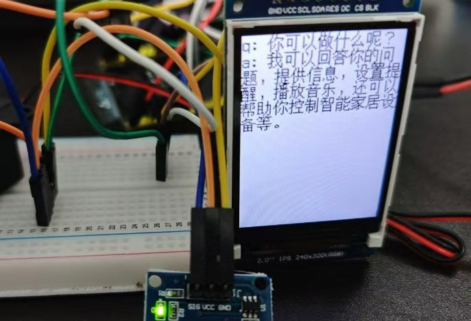

# ESP32-AI-chat

## 简介

本项目使用esp32-s3 基于 micropython
接入讯飞星火大模型、实现语音对话、显示,灵感源自[Explorerlowi ESP32_AI_LLM](https://github.com/Explorerlowi/ESP32_AI_LLM )。

## 功能介绍

* 时间显示
* 湿度显示
* 语音对话
* 时间同步

## 使用说明

### 开通讯飞相关服务

1. 进入讯飞开发平台主页（https://www.xfyun.cn），注册账号，然后进入控制台，创建新应用。
2. 开通相关服务：
   * 星火认知大模型 ->  Spark Pro / Spark Max / Spark4.0 Ultra http
   * 语音识别 -> 语音听写（流式版） websocket
   * 语音合成 -> 在线语音合成（流式版） websocket
3. 记录 APPID APISecret APIKey

### 项目部署

* 开发环境: thonny + micropython v1.23 + esp32-s3N16R8
* 设备UART口连接 电脑
* 刷入micropython 固件
    * [ESP32_GENERIC_S3_OCT](https://micropython.org/resources/firmware/ESP32_GENERIC_S3-SPIRAM_OCT-20240602-v1.23.0.bin)
* 整个项目下载到设备
* 修改 config.py： 填写 XF_APPID 、WIFI_SSID 等配置
* 运行 main_ai.py 测试无问题后可改名为main.py 实现开机自启

### 硬件清单

* ESP32-S3-N16R8、INMP441麦克风、MAX98357音频放大器、dth20温湿度传感器、喇叭、TFT屏幕、面包板 、触摸开关、杜邦线若干、TypeC数据线

### 硬件接线

* INMP441 麦克风：

| 序号 | 模块引脚 | 引脚说明      | 开发板    |
|----|------|-----------|--------|
| 1  | GND  | 电源地       | GND    |
| 2  | VDD  | 3.3v电源    | 3.3v   |
| 3  | SD   | 串行数据输出    | GPIO39 |
| 4  | WS   | 串行数据字选择   | GPIO41 |
| 5  | SCK  | I2S串行数据时钟 | GPIO40 |
| 6  | L/R  | 电源地(声音更清楚) | GND    |

* MAX98357 音频放大模块 ：
    * 喇叭(3瓦 8欧)  正（红）负（黑）极接入

| 序号 | 模块引脚 | 引脚说明   | 开发板    |
|----|------|-----------------|--------|
| 1  | GND  | 电源地             | GND    |
| 2  | VIN  | VCC 电源          | 3.3v   |
| 3  | DIN  | 数字输入信号 sd       | GPIO16 |
| 4  | BCLK | 位时钟信号   sck     | GPIO18 |
| 5  | LRC  | I2S与LJ模式左右时钟 ws | GPIO17 |

* ST7789 1.8寸 240x320 TFT屏幕 ：

| 序号 | 模块引脚 | 引脚说明    | 开发板    |
|----|------|--------------------|--------|
| 1  | GND  | 液晶屏电源地             | GND    |
| 2  | VCC  | 液晶屏电源正(3.3V)       | 3.3v   |
| 3  | SCL  | 液晶屏SPI总线时钟信号  sck  | GPIO12 |
| 4  | SDA  | 液晶屏SPI总线写数据信号 mosi | GPIO11 |
| 5  | RES  | 液晶屏复位控制信号          | GPIO14 |
| 6  | DC   | 液晶屏寄存器/数据选择控制信号    | GPIO13 |
| 7  | CS   | 液晶屏片选控制信号          | GPIO10 |
| 8  | BLK  | 液晶屏背光控制信号） bl      | GPIO9  |

* DHT20 温湿度传感器
    * 也可以选择 dht11 /dth22 microPython自带驱动

| 序号 | 模块引脚 | 引脚说明   | 开发板引脚  |
|----|------|----------------|--------|
| 1  | VDD  | 3.3v电源         | VCC    |
| 2  | SDA  | 串行数据，双向 , mosi | GPIO 4 |
| 3  | GND  | 电源地            | GND    |
| 4  | SCL  | 串行时钟，双向,  sck  | GPIO 5 |

* 触摸开关 TTP223
    * 其他开关也可以，用于触发语音对话

| 序号 | 模块引脚 | 引脚说明         | 开发板    |
|----|------|--------------|--------|
| 1  | GND  | 接地           | GND    |
| 2  | VCC  | 电源(3.3V)     | 3.3v   |
| 3  | SIG  | 液晶屏SPI总线时钟信号  sck | GPIO 1 |

* 3.3v电源口和 GND口不够多 这里用面包板扩展，MAX98357电源尽量接在开发版上（影响音质）

### 项目结构
* lib: 依赖库
* font： 字体文件
* gif： 图片文件
* config.py: 配置文件
* main_ai.py: 主程序入口
* net.py: 网络连接 ntp同步
* boot.py: 开机自联网
* display.py: 屏幕显示
* utils.py: 工具函数
* xunfei_ai.py: 讯飞大模型调用
* xunfei_iat.py: 讯飞语音听写
* xunfei_tts.py: 讯飞语音合成

## 成品参考

## 参考

* https://github.com/Explorerlowi/ESP32_AI_LLM
* https://github.com/danni/uwebsockets
* https://github.com/micropython/micropython-lib
* https://github.com/funnygeeker/micropython-easydisplay
* https://github.com/AntonVanke/MicroPython-uFont

## 其他

* esp32-s3 开发板引脚说明
  